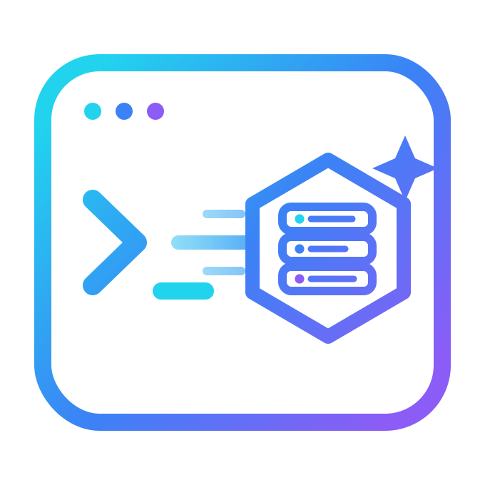

<div align="center">

<picture>
  <source media="(prefers-color-scheme: dark)" srcset="../assets/create-devrig-logo-dark.png">
  
</picture>

**명령어 하나로 [devrig](https://github.com/lakpriya1s/devrig) 워크스페이스 만들기 — 클론도, 별도의 설정 단계도 필요 없습니다.**

[](https://www.npmjs.com/package/create-devrig)
[](https://www.npmjs.com/package/create-devrig)
[](../LICENSE)

[English](../README.md) · [简体中文](README.zh-CN.md) · [Español](README.es.md) · [हिन्दी](README.hi.md) · [Português](README.pt-BR.md) · [日本語](README.ja.md) · [Français](README.fr.md) · **한국어** · [සිංහල](README.si.md)

</div>

---

```bash
npx create-devrig my-project
```

이게 전부입니다. 이 명령어 하나로:

1. [devrig](https://github.com/lakpriya1s/devrig) 템플릿을 `my-project/`에 **가져옵니다** — git 기록 없이 파일만.
2. 그곳에 새로운 git 저장소를 **초기화합니다**.
3. devrig의 대화식 설정 마법사를 즉시 **실행합니다** — 프로젝트 이름, GitHub org, 저장소, 이슈 트래커, 기능 토글을 같은 명령어 안에서 설정합니다. `cd` 후 설정 파일 수정, 설정 실행이라는 별도 단계가 필요 없습니다.

디렉토리를 생략하면 물어봅니다:

```bash
npx create-devrig
```

## 요구 사항

| | |
|---|---|
| **Node.js** | 18+ |
| **git** | 필수 — 템플릿을 가져오고 새 저장소를 초기화하는 데 사용 |
| **bash** | macOS/Linux에서 기본 지원. Windows에서는 WSL이나 Git Bash 안에서 실행하세요 — devrig의 `setup.sh`는 bash 스크립트입니다 |

## 이 패키지가 *하지 않는* 것

devrig의 설정 로직을 다시 구현하지 않습니다 — 템플릿을 가져와서 devrig 자체의 `setup.sh`에 넘길 뿐입니다. devrig의 설정 흐름, 스킬, 설정 스키마가 업데이트되면 다음에 누군가 `npx create-devrig`를 실행할 때 자동으로 반영됩니다. 이 패키지 자체는 거의 변경할 필요가 없습니다.

## npx를 쓰고 싶지 않다면?

GitHub UI로도 똑같이 사용할 수 있습니다:

1. [devrig](https://github.com/lakpriya1s/devrig) 저장소에서 [**Use this template**](https://github.com/lakpriya1s/devrig/generate)을 클릭합니다.
2. 클론한 뒤 직접 `./setup.sh`를 실행합니다.

두 방법 모두 정확히 같은 대화식 마법사로 이어집니다.

## 기여하기

이 패키지는 의도적으로 아주 작게 유지됩니다 — 파일 하나, 의존성 하나([`degit`](https://github.com/Rich-Harris/degit)). 버그 리포트와 작은 수정은 [issues](https://github.com/lakpriya1s/create-devrig/issues)나 PR로 환영합니다. 설정 흐름, 스킬, 설정 스키마 자체를 바꾸고 싶다면, 그건 여기가 아니라 [devrig](https://github.com/lakpriya1s/devrig)에 있습니다.

## 라이선스

MIT — [LICENSE](../LICENSE) 참고.

<div align="center">
<sub><a href="https://github.com/lakpriya1s/devrig">devrig</a> 프로젝트의 일부 ·
<picture><source media="(prefers-color-scheme: dark)" srcset="../assets/create-devrig-icon-dark.png"></picture>
create-devrig</sub>
</div>
